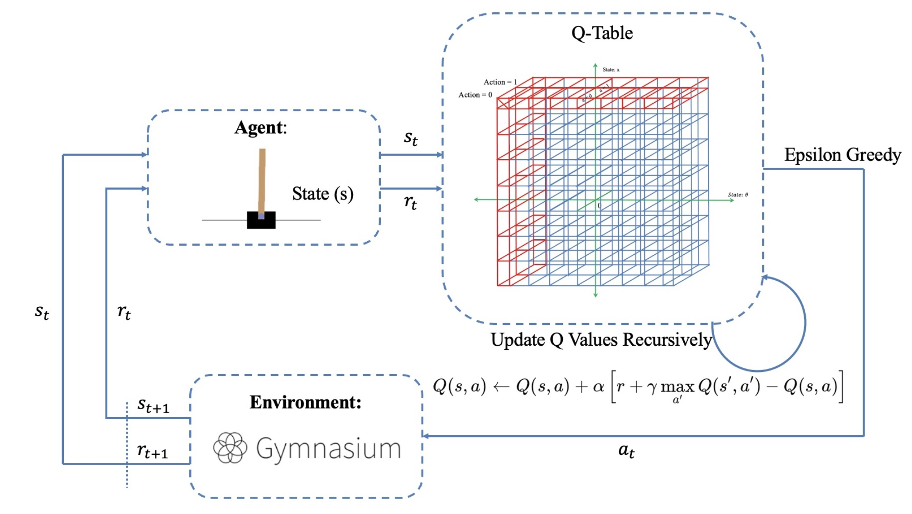
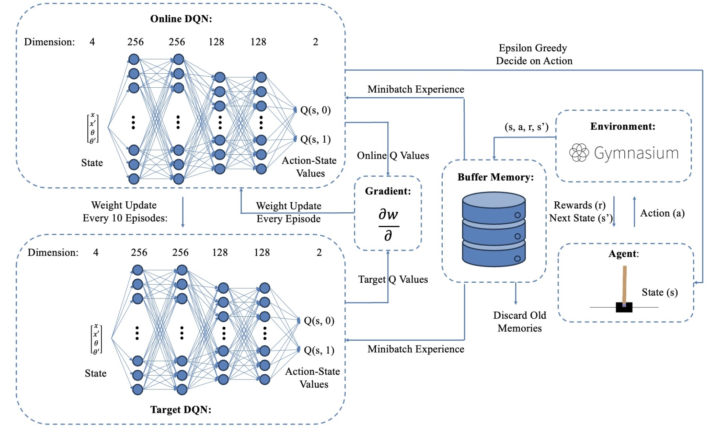
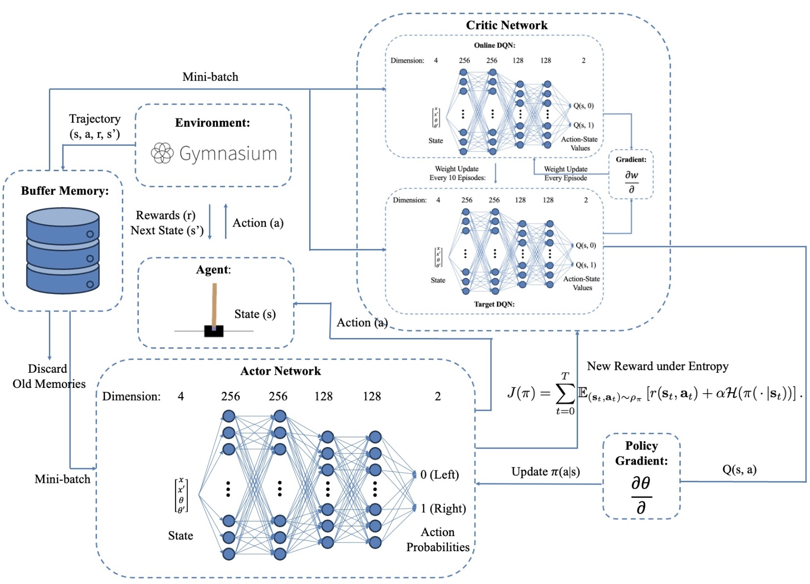
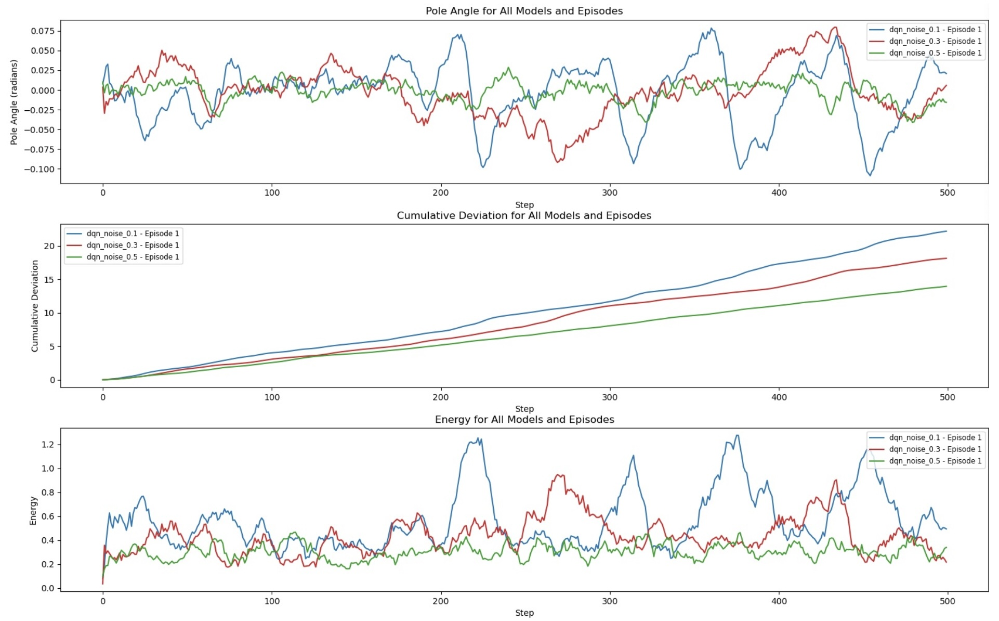

# CLEAR-Net: Cart-Pole Learning with Enhanced Adaptive Reinforcement Network

## Overview
This project compares **Q-learning**, **Deep Q-learning (DQL)**, **Proximal Policy Optimization (PPO)**, and **Soft Actor-Critic (SAC)** methods for solving the cart-pole problem under noisy conditions. The objective is to balance a cart and pole under significant observational noise, ensuring stability and robustness. Our results highlight the importance of hyperparameter tuning and reward shaping, showing that PPO and SAC are better suited for dynamic environments than traditional Q-learning.

## Objectives
The cart-pole task aims to use reinforcement learning to maintain the balance of the cart and pole within predefined constraints:
- Cart position: [-2.4m, +2.4m]
- Pole angle: [-12°, +12°]

## Methods

### 1. Tabular Q-Learning
- Classical Q-learning is implemented by discretizing the continuous observation space.
- Actions are chosen using an epsilon-greedy approach based on the Q-table.

  

### 2. Deep Q-Learning (DQL)
- Incorporates a target network and memory buffer.
- Requires careful hyperparameter tuning (learning rate, batch size, epsilon decay rate, noise level).

  

### 3. Proximal Policy Optimization (PPO)
- Utilizes a stochastic action space and policy clipping for reliable learning.
- Provides smoother learning curves with more stable policy updates.

  

### 4. Soft Actor-Critic (SAC)
- Uses twin Q-networks for stability and adds an entropy term for balanced exploration and exploitation.
- Converts discrete actions to continuous actions for deployment in a discrete action-space problem.

  

## Results
- **DQL** performs better than classical Q-learning but suffers from **catastrophic forgetting** and instability.
- **PPO** and **SAC** outperform other methods, showing superior stability, faster convergence, and robustness in dynamic environments.
- **Higher noise variance** during training results in better performance under real-world disturbances, with PPO and SAC showing the most consistent results.

  

## Conclusion
Classical Q-learning struggles with dimensionality and instability, while DQL faces catastrophic forgetting. **PPO and SAC** demonstrate superior robustness, making them ideal for real-world dynamic environments. **Hyperparameter tuning** and **reward shaping** are critical for improving performance and stability.

## Contributors
- Aravind Narayanan, Qilong Cheng
Electrical and Computer Engineering, University of Toronto
